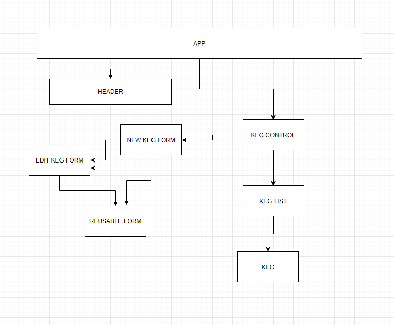

# Fiona's Tap House

#### A sample webpage that allows the user to add various kegs to the menu of a brewery. Created & Updated on 11/20/2020.

#### By: Janet Karpenske

##### This website uses React to allow the user to add kegs to the menu of a brewery.

### Link to Site on Github Pages
#### NA

## Setup/Installation Requirements

1. Download/Clone The Project from the Github Repo by using link from Github, or open terminal and run command: "git clone https://github.com/janetkarpenske/react-tap-room"
2. Navigate into main directory called 'tap-room' and run command "npm install" in terminal.
3. To view on server run command "npm run start".

## React Component Diagram

## Known Bugs
No Known Bugs

## Support & Contact Details
For additional information or to contact Janet Karpenske:
cell: (971) 241-1160
email: janetkarpenske@gmail.com
LinkedIn: Janet Karpenske

## Technologies Used
React, JavaScript, HTML, CSS, Bootstrap, JSX

## Licensing
Copyright (c) 2020 **_{Janet Karpenske}_**

This software is licensed under MIT license.